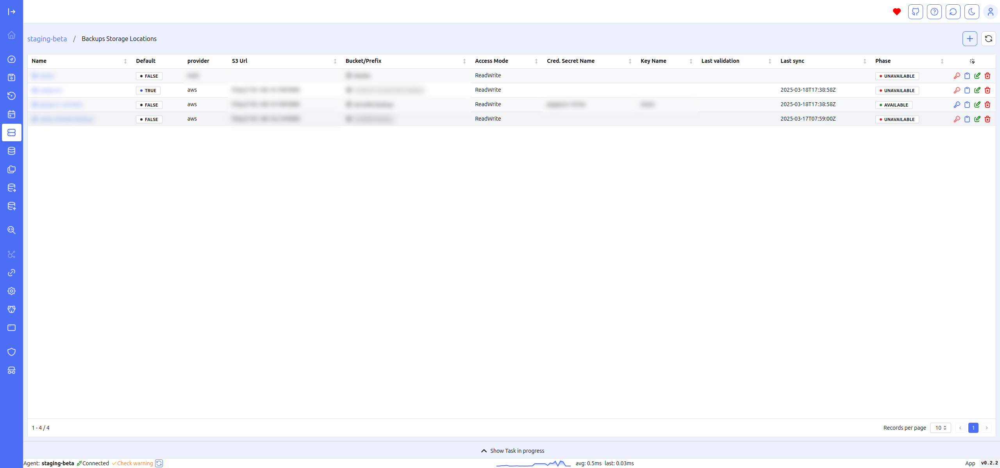

# Overview

Vui provides a web interface to interact with Velero, simplifying the following operations:

- Switching between different clusters (requires core)
- Backup management
- Restore management
- Schedule management
- Retrieving backup location information
- Retrieving snapshot location information
- Storage class mapping
- Restic features (check locks, unlock, unlock --remove-all)

Below is a brief description of the modules that make up the VUI project:

- **Velero-API** is the agent to be installed on each cluster. Velero-API is designed to communicate with Kubernetes and the Velero client within the Kubernetes environment.
- **Velero-UI** is the web interface. The UI interface can be used by connecting directly to the agents or to the core for centralized management.
- **Velero-Watchdog** is the microservice responsible for monitoring the status of Velero in Kubernetes environments and alerting when something is not working:
  - Backups status monitoring
  - Schedules change monitoring
  - Notification alert for immediate action. Available plugins:
    - Email
    - Telegram
    - Slack
- **Velero-Core** is the core component that enables centralized multi-cluster management. Through the core, you can switch between clusters and view the Velero status of all clusters where the agent is deployed via the core dashboard. `Not released`

Following are some screenshots of Vui.

## Environment

The project is developed, tested and put into production on several clusters with the following configurations:

- Kubernetes v1.28.x
- Velero Server 1.11.1/Client v1.11.1
- Velero Server 1.12.1/Client v1.12.1
- Velero Server 1.13.2/Client v1.13.2

## Screenshots

### Core dashboard

### Agent dashboard

The agent dashboard provides a quick overview of the health status of your backups.

### Backups Managment

### Create backups

### Create restore

### Schedules Managment

### Create schedule

### Backup location

### Storage location

### Repo

### Storage Class Map

### Backup describe

### Backup logs

### Configuration

### Watchdog

### Cron schedule heatmap

