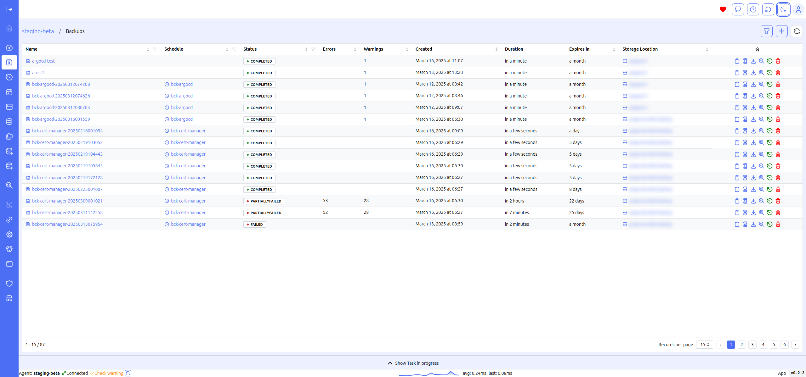

# Overview

Vui provides a web interface to interact with Velero, simplifying the following operations:

- Switching between different clusters (requires core)
- Backup management
- Restore management
- Schedule management
- Retrieving backup location information
- Retrieving snapshot location information
- Storage class mapping
- Restic features (check locks, unlock, unlock --remove-all)

Below is a brief description of the modules that make up the VUI project:

- **Velero-API** is the agent to be installed on each cluster. Velero-API is designed to communicate with Kubernetes and the Velero client within the Kubernetes environment.
- **Velero-UI** is the web interface. The UI interface can be used by connecting directly to the agents or to the core for centralized management.
- **Velero-Watchdog** is the microservice responsible for monitoring the status of Velero in Kubernetes environments and alerting when something is not working:
  - Backups status monitoring
  - Schedules change monitoring
  - Notification alert for immediate action. Available plugins:
    - Email
    - Telegram
    - Slack
- **Velero-Core** is the core component that enables centralized multi-cluster management. Through the core, you can switch between clusters and view the Velero status of all clusters where the agent is deployed via the core dashboard. `Not released`

Following are some screenshots of Vui.

## Environment

The project is developed, tested and put into production on several clusters with the following configurations:

- Kubernetes v1.28.x
- Velero Server 1.11.1/Client v1.11.1
- Velero Server 1.12.1/Client v1.12.1
- Velero Server 1.13.2/Client v1.13.2

## Features

### Core dashboard

Through the Core dashboard, you can view the status of all clusters connected to the Core in a single interface, allowing you to quickly and intuitively monitor the status of Velero backups.

This centralized view not only provides real-time insights into the health and performance of your clusters but also enables you to identify and resolve issues related to backups efficiently. The user-friendly interface ensures that even those with limited technical knowledge can easily navigate and understand the status of their environments.

### Agent dashboard

Through the Agent Dashboard, you can view the status of the selected cluster's backups. 

Additionally, you can see recent backups and identify any namespaces that do not appear in any backup. This feature helps ensure that no critical namespaces are missed during the backup process, providing an added layer of security and reliability. 

The ability to review recent backups directly within the Agent Dashboard allows for quick verification and auditing, making it easier to maintain compliance and recover data when necessary.

### Backups Managment

Backup Management is the main screen for managing backups. You can create new backups, view existing ones, access logs and descriptions for each backup, perform restores, or delete backups. The table view consolidates essential data, allowing you to quickly access key details, including errors, warnings, the duration of the last backup, and expiration.

This centralized management screen simplifies the process of backup administration by offering all necessary tools in one place. The intuitive table layout ensures that critical information is easily accessible, reducing the time needed to monitor and manage backup operations. This setup is particularly beneficial for identifying and addressing issues promptly, ensuring the integrity and reliability of your data backups.

#### Backup logs

#### Backup describe

### Create backups

The backup creation form, with dropdown menus populated with relevant fields, simplifies data entry, allowing you to create new backups quickly and intuitively.

This streamlined process reduces the likelihood of errors during backup configuration by guiding users through the necessary steps with pre-populated options. The intuitive design of the form ensures that even less experienced users can confidently create backups, while advanced users can efficiently manage complex backup scenarios with minimal effort.

### Create restore

The "Create Restore" form allows you to restore a backup. You can map namespaces and view the PVCs contained in the backup, along with their respective storage classes and any mappings to be used during the restore process.

This form provides a comprehensive overview of the restore process, ensuring that all critical elements are correctly configured. The ability to map namespaces and storage classes adds flexibility, enabling you to adapt the restore to different environments or configurations. This detailed level of control helps to ensure a smooth and successful recovery, minimizing potential issues during the restore process.

### Schedules Managment

Schedule Management is the main screen for managing schedules. You can create new schedules, view existing ones, access details for each backup, manually trigger the event, pause it, or delete it. The table view consolidates essential data, allowing you to quickly access key details such as the schedule, TTL, last backup time, and pause status.

The centralized management of schedules in this interface allows for efficient planning and monitoring of automated backup processes. The ability to trigger backups on demand and pause schedules provides flexibility in managing resources and responding to immediate needs. The table format ensures that all critical information is at your fingertips, enabling swift decision-making and reducing the time spent on routine administrative tasks.

### Cron schedule heatmap

A particularly interesting feature under Schedule is the Cron Schedule Heatmap. This feature allows you to visualize the expected duration and potential overlap of backups throughout the week, efficiently displaying any workload peaks. The heatmap is constructed based on the following rules:

- Generation of events triggered for each schedule over the next 7 days
- Duration is estimated based on the actual duration of the last executed backup for each schedule

The Cron Schedule Heatmap helps in optimizing backup schedules by providing a clear visual representation of potential conflicts and resource utilization. This enables administrators to adjust schedules proactively to avoid overlaps and manage system load effectively, ensuring smoother operation and better allocation of resources.

### Create schedule

The schedule creation form, with dropdown menus populated with relevant fields, simplifies data entry, allowing you to create new schedules quickly and intuitively.

This user-friendly design streamlines the scheduling process, reducing the potential for errors and saving time. By guiding users through the necessary steps with pre-populated options, the form ensures that schedules are created accurately and efficiently, catering to both novice and experienced users.

### Backup location

The Backup Location screen allows you to view the data of the backup locations configured in Velero in a tabular format. The table quickly displays essential details such as provider, bucket, phase, and access mode.

This tabular view provides a clear and organized snapshot of all configured backup locations, enabling you to manage and verify storage settings efficiently. By displaying key details at a glance, it helps in monitoring the status and accessibility of backup locations, ensuring that your backup infrastructure is functioning correctly and securely.

### Snapshot location

The Snapshot Location screen allows you to view the data of the snapshot locations configured in Velero in a tabular format. The table quickly displays essential details such as provider and bucket.

### Repo

The Repo screen allows you to view the data of Kopia or Restic repositories in a tabular format. The table quickly displays essential details such as volume namespace, backup storage location, repository type, locks (only for Restic), and identifier. Additionally, you can calculate the size of the repository. For Restic repositories, the available functions include check locks, unlock, and unlock --remove all.

This interface provides a comprehensive overview of repository configurations, enabling efficient management and troubleshooting. The ability to calculate repository size helps in monitoring storage usage and planning capacity. The specific functions for Restic repositories facilitate maintenance and security by allowing you to check and manage lock statuses.

### Storage Class Map

The Storage Class Map screen allows you to define the mapping of storage classes to be used during the backup restore process, facilitating restoration in different environments.

This feature is particularly useful for adapting backup restores to diverse environments or storage configurations. By mapping storage classes appropriately, you can ensure that data is restored with the right performance characteristics and compliance, regardless of where it is being restored. This flexibility supports smoother migrations, disaster recovery efforts, and cross-environment consistency.

### Configuration

The Configuration screen displays the settings for Velero API and Velero UI.

### Watchdog

The Watchdog screen allows you to view the settings for the watchdog and test the notification channels.

This screen is essential for monitoring and managing the watchdog service, which helps ensure system reliability and prompt notifications of issues. By testing notification channels, you can verify that alerts are being sent correctly and ensure that the watchdog is properly configured to monitor critical system events and conditions. 
