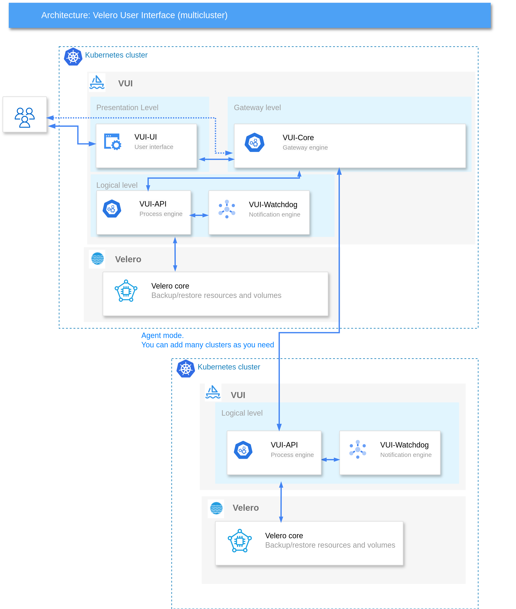

# Software Architecture

## Single cluster

In a single cluster installation, all components are deployed within that one cluster.

The software architecture of the VUI project is organized into the following layers:

- **Presentation Layer (VUI-UI)**: This layer manages the web interface that is displayed to users.
- **Logical Layer (VUI-API and VUI-Watchdog)**: This layer processes all user requests made through the graphical interface, interacts with the Velero engine, and sends notifications when events occur.

Each element of the project is developed as a indipendent service

