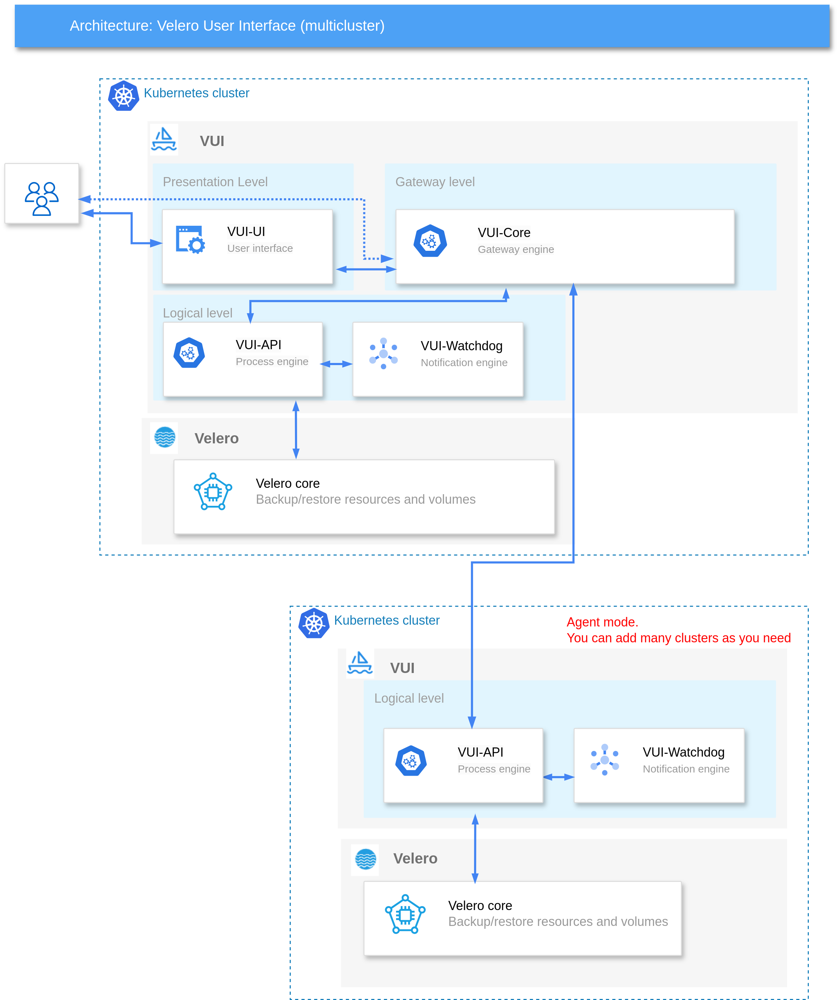

## Multicluster

For those who need to manage several Kubernetes clusters but want to centralise the web interface (VUI-UI), the **VUI-Core** component acts as a gateway. The component send the user requests only to the active connection.

:::warning
The VUI-Core component is not yet released
:::

:::info
The **Presentation layer** and the **Gateway layer** must be deployed once, possibly in the same cluster. The **Logical layer** runs as an agent and can be deployed several times in a different clusters.
:::

---
:::tip
The VUI-Core could be used also if you handle a single cluster
:::