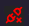

# Tools

## Diagnostic

Diagnostics is a tool that allows you to quickly identify warnings and/or configuration error.

In the bottom part of the page, next to the agent name there will be the diagnostic status.

The result of the checks could be:
    - **All Check Passed** (green fontcolor) if no error/warnings are active
    - **Check warning** (orange fontcolor) if is a warning is active
    - **Error** (red fontcolor) if is an error is active

To access the diagnostics mask click on the **status**.

:::tip
If the icon before the **Agent** name is , the VUI-API (agent) endpoint is not reachable
:::
