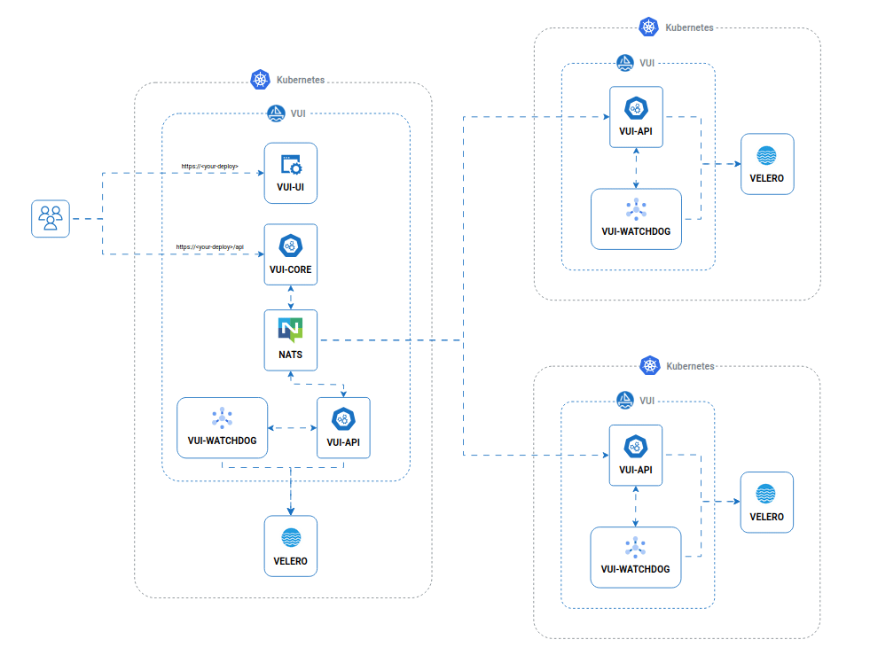

# Multi-Cluster

For users managing multiple Kubernetes clusters, the **`vui-core`** component serves as a central gateway that enables unified access and control.  
Instead of deploying a separate web interface `vui-ui` in each cluster, `vui-core` allows you to connect all clusters to a single instance of the UI.

:::info
In a typical multi-cluster setup:

- In the **primary cluster** (where `vui-core` is deployed), the following components are installed:
  - `vui-core`
  - `nats`
  - `vui-api`
  - `vui-ui`
  - `vui-watchdog`

- In each **connected secondary cluster**, only the agent components are installed:
  - `vui-api`
  - `vui-watchdog`

:::

:::tip
Even if you're currently managing a single cluster, deploying `vui-core` can be useful to prepare for future multi-cluster expansion or centralized access needs.
:::
