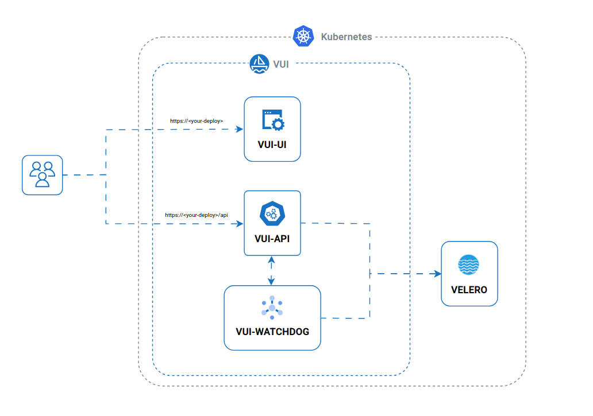

# Single Cluster

In a single-cluster installation, all components are deployed within the same Kubernetes cluster.

The VUI software architecture is organized into the following layers:

- **Presentation Layer `vui-ui`**  
  Handles the web interface and user interactions.

- **Logic Layer `vui-api` and `vui-watchdog`**  
  Processes user actions from the UI, communicates with the Velero engine, and manages event-driven notifications.

Each component is developed as an independent microservice to ensure modularity and ease of maintenance.

