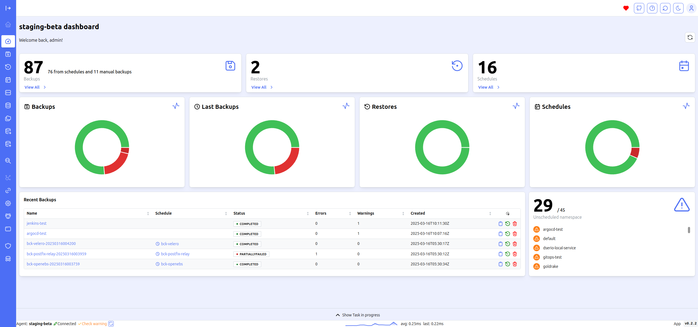

# Agent dashboard

Through the Agent Dashboard, you can view the status of the selected cluster's backups.

Additionally, you can see recent backups and identify any namespaces that do not appear in any backup. This feature helps ensure that no critical namespaces are missed during the backup process, providing an added layer of security and reliability.

The ability to review recent backups directly within the Agent Dashboard allows for quick verification and auditing, making it easier to maintain compliance and recover data when necessary.
