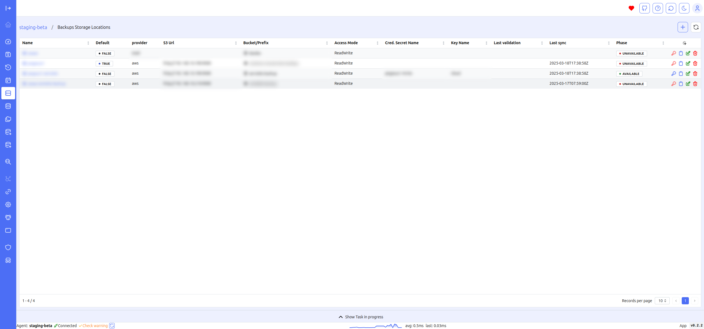
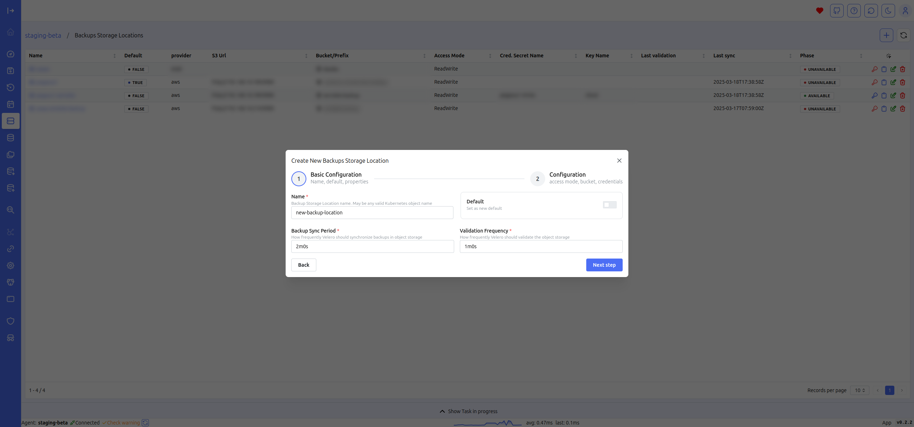
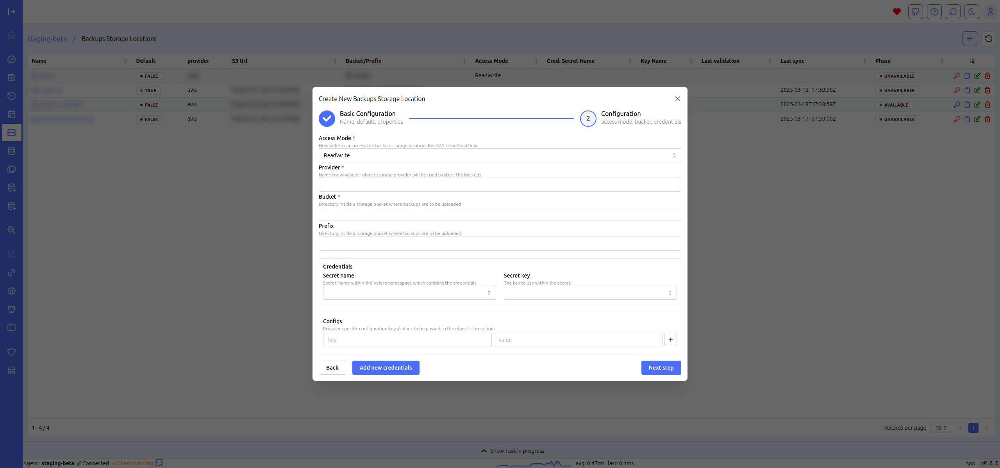
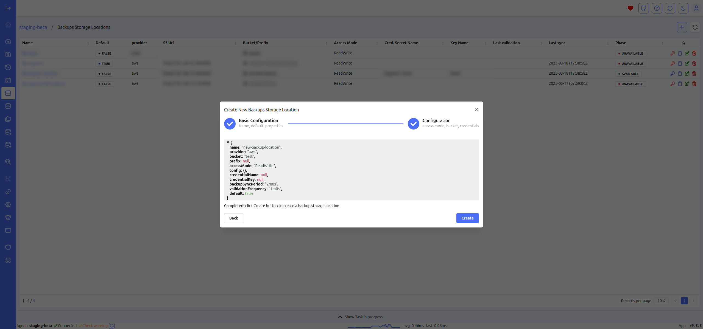

# Backup location

The Backup Location screen allows you to view the data of the backup locations configured in Velero in a tabular format. The table quickly displays essential details such as provider, bucket, phase, and access mode.

This tabular view provides a clear and organized snapshot of all configured backup locations, enabling you to manage and verify storage settings efficiently. By displaying key details at a glance, it helps in monitoring the status and accessibility of backup locations, ensuring that your backup infrastructure is functioning correctly and securely.

## Create Backup location

