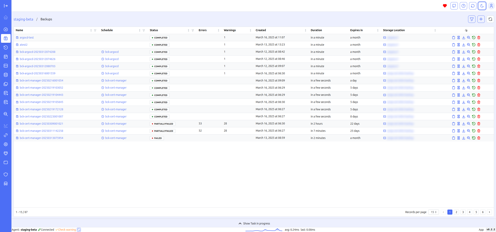
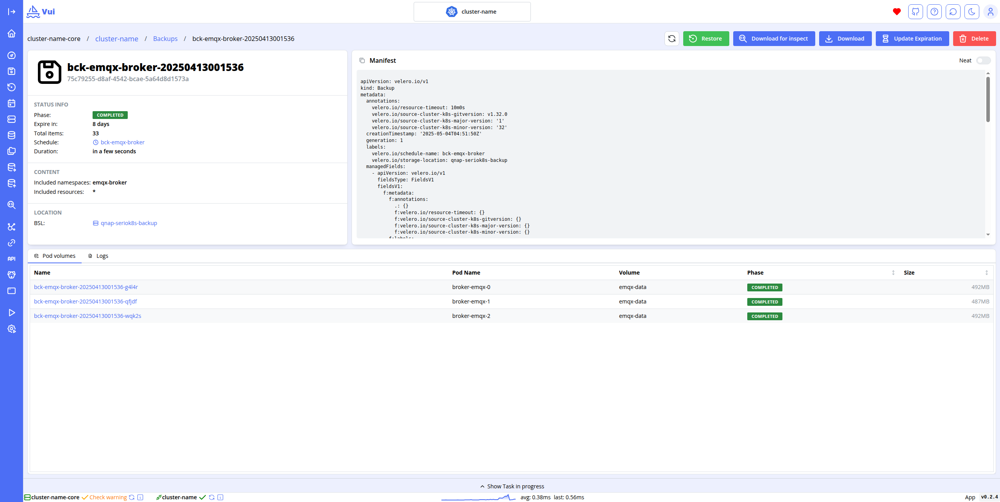
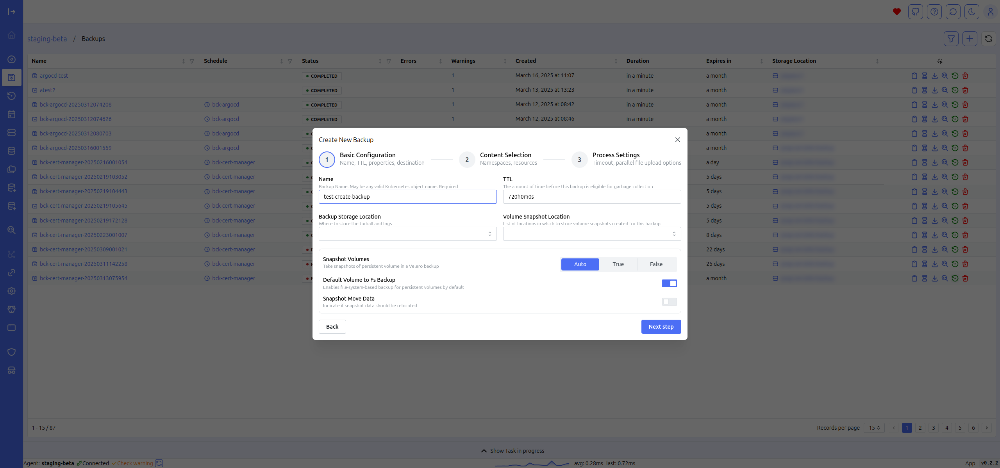
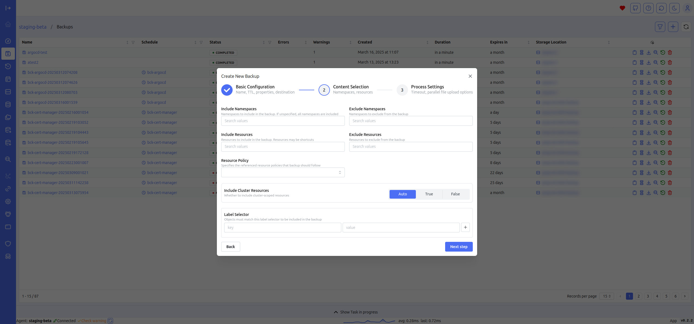
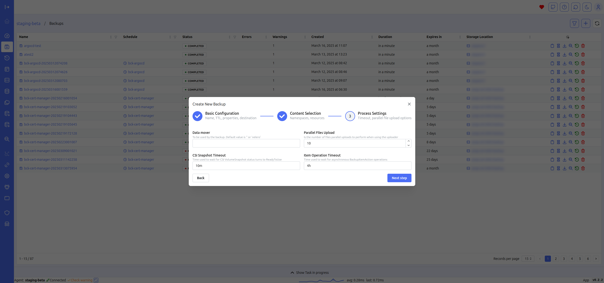
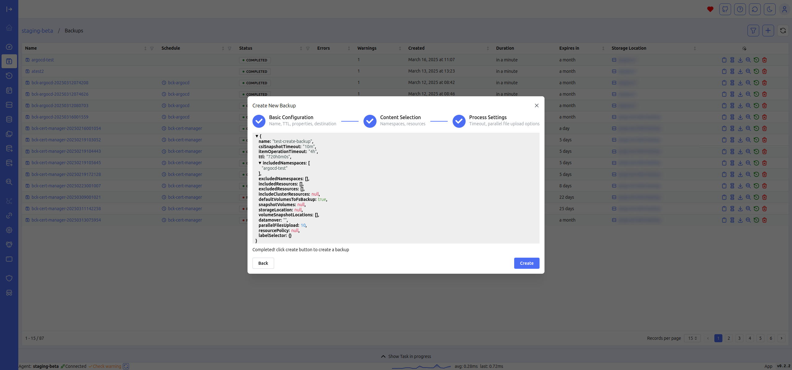

# Backups Managment

Backup Management is the main screen for managing backups. You can create new backups, view existing ones, access logs and descriptions for each backup, perform restores, or delete backups. The table view consolidates essential data, allowing you to quickly access key details, including errors, warnings, the duration of the last backup, and expiration.

This centralized management screen simplifies the process of backup administration by offering all necessary tools in one place. The intuitive table layout ensures that critical information is easily accessible, reducing the time needed to monitor and manage backup operations. This setup is particularly beneficial for identifying and addressing issues promptly, ensuring the integrity and reliability of your data backups.

## Backup Details

## Create backups

The backup creation form, with dropdown menus populated with relevant fields, simplifies data entry, allowing you to create new backups quickly and intuitively.

This streamlined process reduces the likelihood of errors during backup configuration by guiding users through the necessary steps with pre-populated options. The intuitive design of the form ensures that even less experienced users can confidently create backups, while advanced users can efficiently manage complex backup scenarios with minimal effort.

