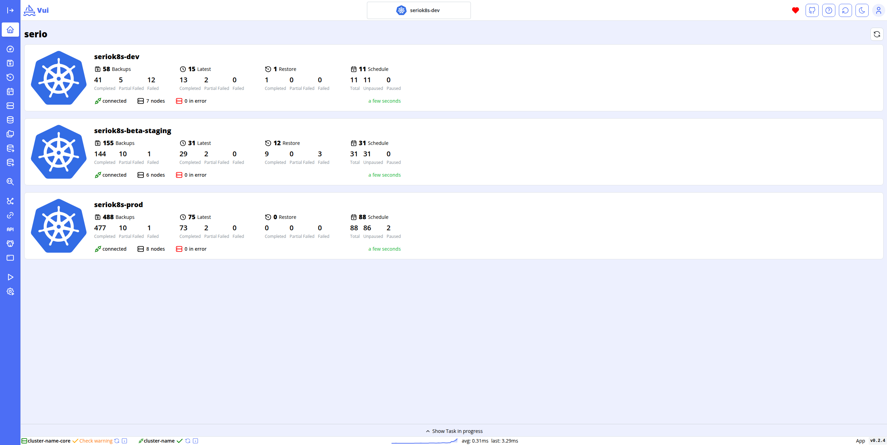

# Core dashboard

Through the Core dashboard, you can view the status of all clusters connected to the Core in a single interface, allowing you to quickly and intuitively monitor the status of Velero backups.

This centralized view not only provides real-time insights into the health and performance of your clusters but also enables you to identify and resolve issues related to backups efficiently. The user-friendly interface ensures that even those with limited technical knowledge can easily navigate and understand the status of their environments.
