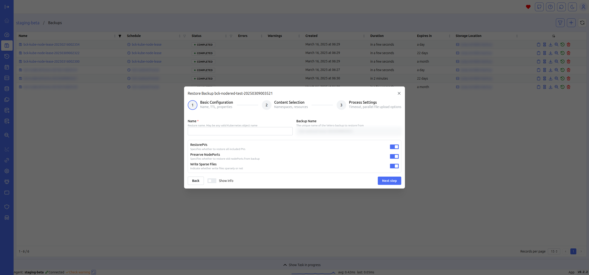
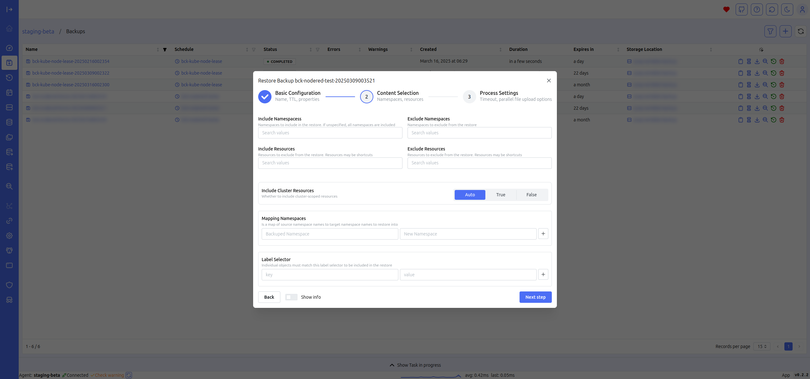
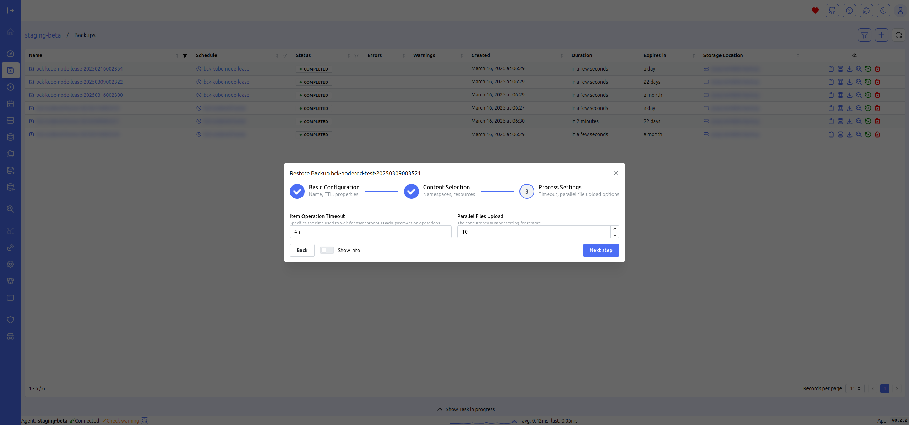
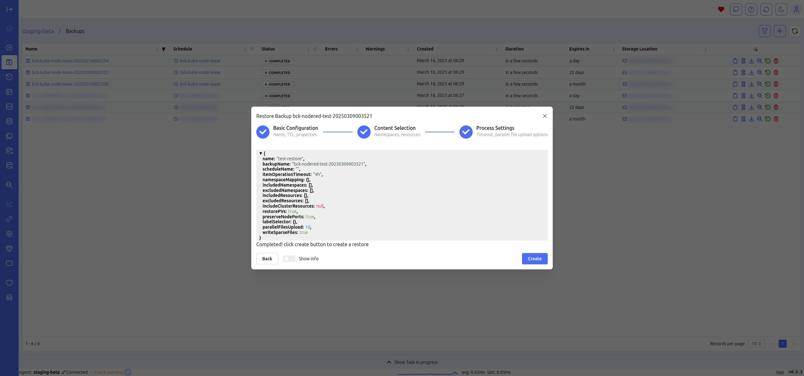

# Create restore

The "Create Restore" form allows you to restore a backup. You can map namespaces and view the PVCs contained in the backup, along with their respective storage classes and any mappings to be used during the restore process.

This form provides a comprehensive overview of the restore process, ensuring that all critical elements are correctly configured. The ability to map namespaces and storage classes adds flexibility, enabling you to adapt the restore to different environments or configurations. This detailed level of control helps to ensure a smooth and successful recovery, minimizing potential issues during the restore process.

