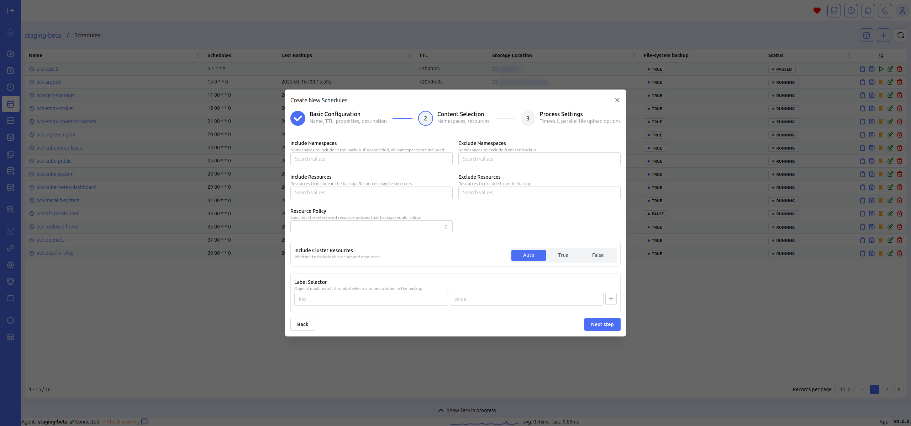

# Schedules Managment

Schedule Management is the main screen for managing schedules. You can create new schedules, view existing ones, access details for each backup, manually trigger the event, pause it, or delete it. The table view consolidates essential data, allowing you to quickly access key details such as the schedule, TTL, last backup time, and pause status.

The centralized management of schedules in this interface allows for efficient planning and monitoring of automated backup processes. The ability to trigger backups on demand and pause schedules provides flexibility in managing resources and responding to immediate needs. The table format ensures that all critical information is at your fingertips, enabling swift decision-making and reducing the time spent on routine administrative tasks.

## Cron schedule heatmap

A particularly interesting feature under Schedule is the Cron Schedule Heatmap. This feature allows you to visualize the expected duration and potential overlap of backups throughout the week, efficiently displaying any workload peaks. The heatmap is constructed based on the following rules:

- Generation of events triggered for each schedule over the next 7 days
- Duration is estimated based on the actual duration of the last executed backup for each schedule

The Cron Schedule Heatmap helps in optimizing backup schedules by providing a clear visual representation of potential conflicts and resource utilization. This enables administrators to adjust schedules proactively to avoid overlaps and manage system load effectively, ensuring smoother operation and better allocation of resources.

## Create schedule

The schedule creation form, with dropdown menus populated with relevant fields, simplifies data entry, allowing you to create new schedules quickly and intuitively.

This user-friendly design streamlines the scheduling process, reducing the potential for errors and saving time. By guiding users through the necessary steps with pre-populated options, the form ensures that schedules are created accurately and efficiently, catering to both novice and experienced users.

