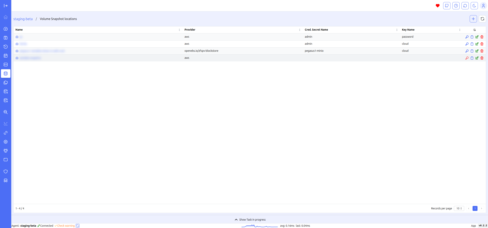
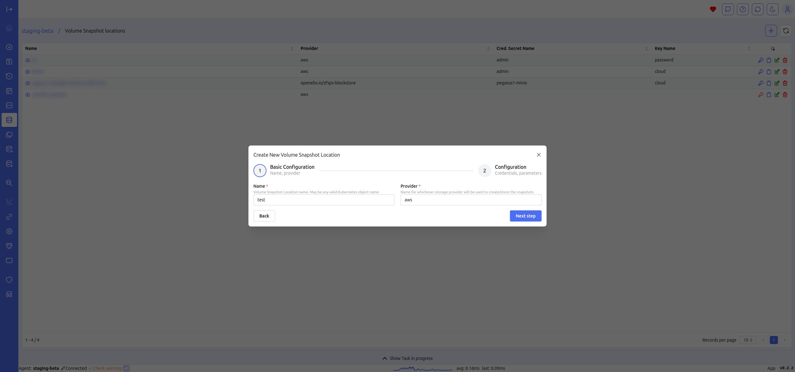
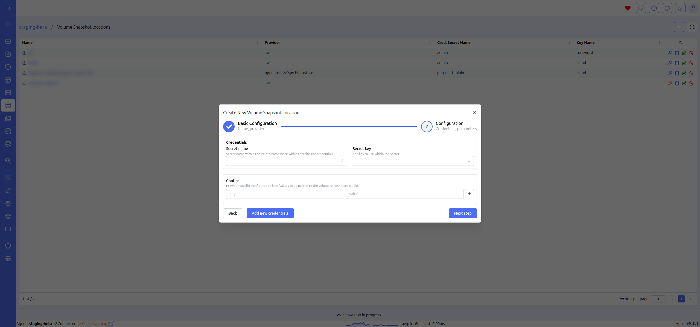
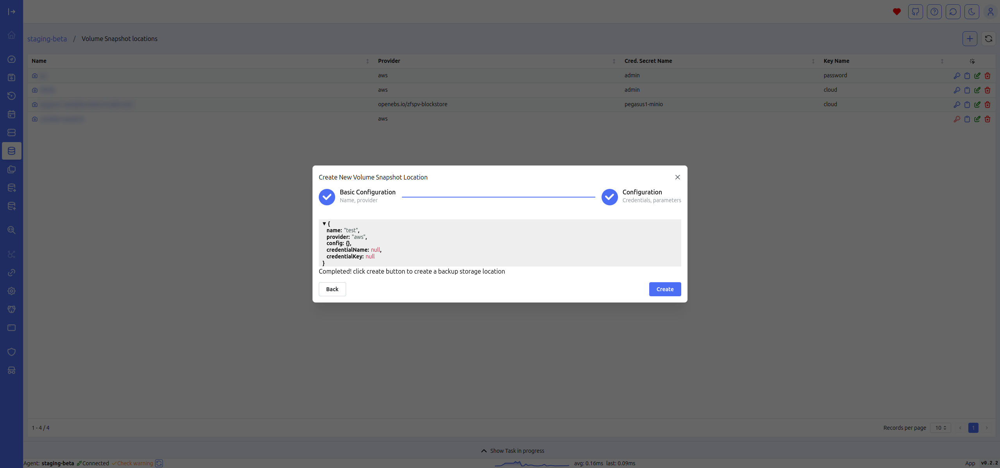

# Snapshot location

The Snapshot Location screen allows you to view the data of the snapshot locations configured in Velero in a tabular format. The table quickly displays essential details such as provider and bucket.

## Create Snapshot location

