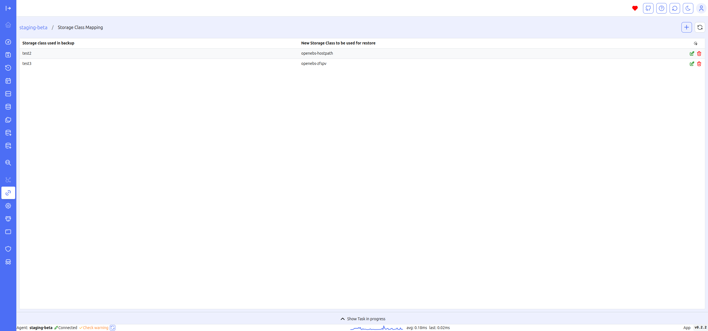

# Storage Class Map

The Storage Class Map screen allows you to define the mapping of storage classes to be used during the backup restore process, facilitating restoration in different environments.

This feature is particularly useful for adapting backup restores to diverse environments or storage configurations. By mapping storage classes appropriately, you can ensure that data is restored with the right performance characteristics and compliance, regardless of where it is being restored. This flexibility supports smoother migrations, disaster recovery efforts, and cross-environment consistency.
