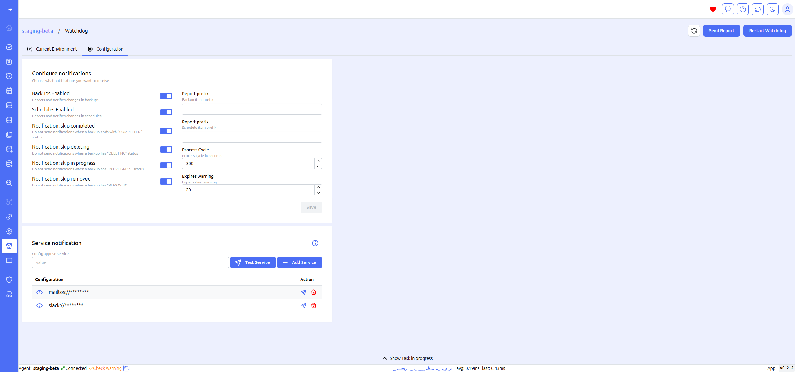

# Watchdog

The Watchdog screen allows you to view the settings for the watchdog and test the notification channels.

This screen is essential for monitoring and managing the watchdog service, which helps ensure system reliability and prompt notifications of issues. By testing notification channels, you can verify that alerts are being sent correctly and ensure that the watchdog is properly configured to monitor critical system events and conditions. 